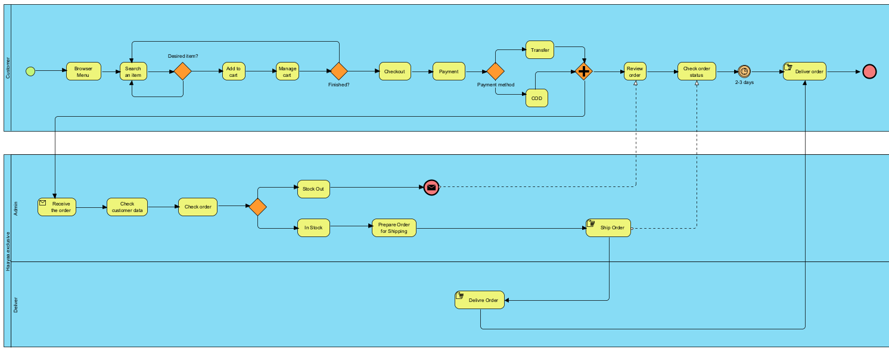

# Modern-Ecommerce-Platforms
Design and Develop Modern Ecommerce Plafform

# Abstract
Store design is user-centered in developing web stores. It sheds light on the important role that user experience plays in influencing consumer behavior and driving online sales. By optimizing the web store design and aligning it with the expectations of business users. This project is a resource for web stores. e-commerce business and better understand the complex relationship between web store design and user behavior In the end This contributes to the broader conversation on creating a successful, easy-to-use web store in today's digital marketplace.

# INTRODUCTION
### PROJECT OVERVIEW
This project is about developing an e-commerce website for haayaashop, a children's store. I'm creating a website for my business. It's an online sales website. I use WordPress to create the website because it's easy to use and offers new functionality as needed.

**WordPress** : The most popular and widely used website creation and platform. It is open source software. This means it's free to use and can be customized to create a variety of websites. From simple blogs to complex e-commerce sites and corporate websites, WordPress and its ease of use.  <a href= "https://en.wikipedia.org/wiki/WordPress"> WordPress 

**Plugin** : A small software application that extends the features and functions of a WordPress website. <a href= "https://www.wpbeginner.com/glossary/plugin/#:~:text=In%20WordPress%2C%20a%20plugin%20is,a%20single%20line%20of%20code."> Plugin

**Themes** : Theme changes the design of your website, often including its layout. Changing your theme changes how your site looks on the front-end.  <a href= "https://developer.wordpress.org/themes/getting-started/what-is-a-theme/"> Theme 

**WooCommerce** : An ecommerce plugin that works with WordPress.  <a href= "https://www.nexcess.net/blog/10-reasons-to-choose-woocommerce/#:~:text=WooCommerce%20is%20an%20ecommerce%20plugin%20that%20works%20with%20WordPress.,free%20and%20easy%20to%20use."> WooCommerce

**User registration** : User registration in WordPress refers to the process by which individuals can create accounts and become registered users on a WordPress-powered website.  <a href= "https://themeisle.com/blog/user-registration-in-wordpress/#gref"> User registration

**Product** : Simply an individual physical commodity (electronic device, shoes, or anything similar).  <a href= "https://wpastra.com/woocommerce-tutorial/add-woocommerce-products/#:~:text=A%20simple%20product%20is%20simply,product%20is%20a%20straightforward%20process."> Product

**Laragon** : A portable, isolated, fast, and powerful universal development environment for building and managing various web applications based on PHP, Node. js, Python, Go, and Ruby.  <a href= "https://www.nexcess.net/help/laragon/#:~:text=Laragon%20is%20a%20portable%2C%20isolated,doesn't%20use%20Windows%20services."> Laragon

### OBJECTIVE
1.To design and develop your own store website.

2.For convenience and ease for users.

### SOFTWARE AND HARDWARE REQUIREMENTS

**SOFTWARE**
- Web Server
- PHP
- Database Management System
- WordPress Files

**Hardware Requirements**
- Processor (CPU)
- Memory (RAM)
- Network Connection

# LITERATURE REVIEW

# METHODOLOGY
In study and developing my website This project uses Agile methodology. The Agile methodology is a project management approach that involves breaking the project into phases and emphasizes continuous collaboration and improvement. <a href= "https://www.atlassian.com/agile#:~:text=The%20Agile%20methodology%20is%20a,planning%2C%20executing%2C%20and%20evaluating."> Agile methodology

  

The Agile methodology defines a project life cycle as consisting of seven phases: Plan, Design, Develop, Test, Deploy, Review, Launch. Each of which includes building business models, requirements, analysis and design, implementation, testing, and deployment.

**Plan** : It covers the key steps to creating and managing a successful web store, providing a structured approach to ensuring my online store is well prepared. customer focus and was able to meet my business goals and adjust the plan as needed to meet the unique needs of my web store and target audience.

**Design** : Design your web shop's user interface and user experience (UI/UX) with a focus on ease of navigation, aesthetics, and mobile responsiveness.

**Develop** : 

**Test** : During system development To create the best version of your website Developers will make sure to test the system and collect system errors. during testing Developers will perform two types of testing: system testing and user testing for system testing. If an error occurs Developers will edit and try to complete the work. For testing by developer users Let users view the system and give feedback on what features should be changed. There were a few points where users asked the Developer to make changes. My website was accepted.

**Deploy** :

**Review** :

**Launch** :

# EXPERIMENTATION AND RESULT
My project uses BPMN diagrams to summarize the key processes step-by-step of my website to provide insights into user experience and functionality.

  

My project uses BPMN diagrams to summarize the key processes step-by-step of my website to provide insights into user experience and functionality.

