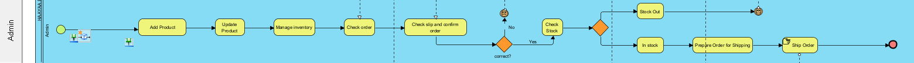

# Modern-Ecommerce-Platforms
Design and Develop Modern Ecommerce Plafform

# Abstract
Store design is user-centered in developing web stores. It sheds light on the important role that user experience plays in influencing consumer behavior and driving online sales. By optimizing the web store design and aligning it with the expectations of business users. This project is a resource for web stores. e-commerce business and better understand the complex relationship between web store design and user behavior In the end This contributes to the broader conversation on creating a successful, easy-to-use web store in today's digital marketplace.

# INTRODUCTION
### PROJECT OVERVIEW
In today's digital age, the way we shop has undergone a significant transformation. With the advent of e-commerce, shopping has become more convenient, accessible, and diverse than ever before. We are delighted to introduce **Haayaashop**, your ultimate online shopping destination designed to cater to all your needs, preferences, and desires. This project is about developing an e-commerce website for haayaashop, a children's store. I'm creating a website for my business. It's an online sales website. I use WordPress and WooCommerce to create the website because it's easy to use and offers new functionality as needed. 

**WordPress** : The most popular and widely used website creation and platform. It is open source software. This means it's free to use and can be customized to create a variety of websites. From simple blogs to complex e-commerce sites and corporate websites, WordPress and its ease of use.  <a href= "https://en.wikipedia.org/wiki/WordPress"> WordPress 

**Plugin** : A small software application that extends the features and functions of a WordPress website. <a href= "https://www.wpbeginner.com/glossary/plugin/#:~:text=In%20WordPress%2C%20a%20plugin%20is,a%20single%20line%20of%20code."> Plugin

**PDF Invoices & Packing Slips for WooCommerce** : a plugin for the WooCommerce e-commerce platform that allows store owners to automatically generate and send PDF invoices and packing slips to customers after they place an order. <a href= "https://yaycommerce.com/create-woocommerce-pdf-invoices-packing-slips/#:~:text=WooCommerce%20PDF%20Invoices%20and%20Packing%20Slips%20is%20a%20plugin%20for,after%20they%20place%20an%20order."> PDF Invoices & Packing Slips for WooCommerce

**Jetpack** : provides powerful, easy-to-use WordPress security that protects your site from hackers and malware. <a href= "https://jetpack.com/blog/what-is-the-jetpack-plugin/#:~:text=Jetpack%20provides%20powerful%2C%20easy%2Dto,Spam%20prevention%20tools"> Jetpack

**MailPoet** : Use MailPoet to create, send, manage, and grow your email marketing campaigns – all without leaving your WordPress dashboard. <a href= "https://wordpress.org/plugins/mailpoet/#:~:text=Description,without%20leaving%20your%20WordPress%20dashboard."> MailPoet

**Simple WordPress Membership** : lets you publish exclusive content, sell membership subscriptions, and accept payments from members. <a href= "https://barn2.com/blog/simple-wordpress-membership/#:~:text=A%20simple%20WordPress%20membership%20plugin,be%20overkill%20for%20your%20needs."> Simple WordPress Membership

**Themes** : Theme changes the design of your website, often including its layout. Changing your theme changes how your site looks on the front-end.  <a href= "https://developer.wordpress.org/themes/getting-started/what-is-a-theme/"> Theme 

**WooCommerce** : An ecommerce plugin that works with WordPress.  <a href= "https://www.nexcess.net/blog/10-reasons-to-choose-woocommerce/#:~:text=WooCommerce%20is%20an%20ecommerce%20plugin%20that%20works%20with%20WordPress.,free%20and%20easy%20to%20use."> WooCommerce

**Product** : Simply an individual physical commodity (electronic device, shoes, or anything similar).  <a href= "https://wpastra.com/woocommerce-tutorial/add-woocommerce-products/#:~:text=A%20simple%20product%20is%20simply,product%20is%20a%20straightforward%20process."> Product

**Laragon** : A portable, isolated, fast, and powerful universal development environment for building and managing various web applications based on PHP, Node. js, Python, Go, and Ruby.  <a href= "https://www.nexcess.net/help/laragon/#:~:text=Laragon%20is%20a%20portable%2C%20isolated,doesn't%20use%20Windows%20services."> Laragon

### OBJECTIVE
1.To design and develop your own store website.

2.For convenience and ease for users.

### SOFTWARE AND HARDWARE REQUIREMENTS

**SOFTWARE**
- Web Server
- PHP
- Database Management System
- WordPress Files

**Hardware Requirements**
- Processor (CPU)
- Memory (RAM)
- Network Connection

# LITERATURE REVIEW
Web shop can help you understand the key concepts, theories, and best practices in the field of e-commerce and online retail.

### HomePage

  

  

### BPMN Diagram

My project uses BPMN diagrams to summarize the key processes step-by-step of my website to provide insights into user experience and functionality.

  

The first step is to design the entire functionality of the website and how it will work both internally and externally using BPMN as the core, with the customer, system, admin, bank, deliverables.

### Customer
Customer activity on our website

  

- **Browser Menu :** Starts with the customer opening our website it will show Browser Menu Page.

- **Search an item :** Customers can search for the products they want on our website.

  

- **Add to Cart :** Finished adding desired products to cart, Customer can also reduce or add products as desired and this will lead to the next step.

- **Manage cart :** will display the details of the product list, The number of orders, the price, and the total amount automatically.

  

- **Checkout :**

  

- **Payment :**

  

- **Review order :**

  

- **Check order status :**

- **Recieve the product :**

### System

  

- **Receive the order :**

- **order status :**

- **Creat a packing Slips :**

### Admin

  

- **Add Product :**

  

- **Update Product :**

- **Check order :**

  

- **Check stock :**

- **Prepare order :**

- **Ship Order :**

# METHODOLOGY
In study and developing my website This project uses **Agile methodology**

The Agile methodology is a project management approach that involves breaking the project into phases and emphasizes continuous collaboration and improvement. <a href= "https://www.atlassian.com/agile#:~:text=The%20Agile%20methodology%20is%20a,planning%2C%20executing%2C%20and%20evaluating."> Agile methodology

  

In studying and developing Haayaashop, we are committed to implementing Agile methodology to enhance the software continuously. Agile development remains relentless, unwavering even in the face of external factors that may impede progress. This approach is particularly crucial in times of rapid and unpredictable change.

Agile represents both a framework and a method, enabling us to work swiftly and adapt effectively. It equips us with the agility to promptly respond to customer needs amid uncertain conditions. In our Agile adoption, we will selectively apply Agile principles to our existing documentation and systems, integrating them seamlessly into our workflow.

**Plan**
- In this step, the team determines the project objectives and needs of online shopping website Haayaashop.
- Planning should include defining the scope of the project and creating a list of tasks to be done.

**Design**
- During this stage, the team designs the structure and various components of Haayaashop.
- Design work includes creating web page layouts, database schemas, and user interfaces.

**Develop**
- Develop a WordPress theme or customize an e-commerce theme to meet the design and functionality requirements.
- Choose utilizing WordPress plugins to implement e-commerce features such as product catalogs, shopping carts, and payment processing.

**Test**
- After development, the team tests and verifies the correctness and performance of the website.

**Deploy**
- Once testing is successful, the team deploys Haayaashop for actual use.
- Deployment should follow a controlled process and prepare for registration and usage.

**Review**
- After deployment We will evaluate the progress and effectiveness of the project.

**Launch**
- When the project is ready and has passed all checks, the team launches Haayaashop for users.
- Launching should be organized and prepared for user registration and usage.

# CONCLUSION
In the last part, this chapter summaries this project including the result that was the project requirement and design, development, testing.
Haayaashop Website is a powerful platform for creating and managing websites of all types and sizes. It's easy to use, and its extensive customization options make it a popular choice for individuals, businesses, and organizations looking to establish an online presence. WordPress and WooCommerce provides tools and resources to help you succeed on the web.
